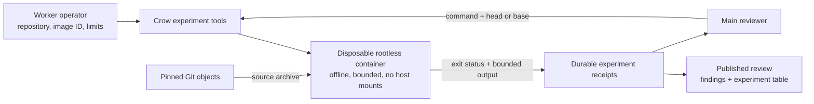

# Runtime experiments



`src/execution.rs` owns authorization, runtime checks, container lifecycle, output capture, budgets and receipts. The existing inspection MCP process advertises its tools only for an authorized repository's main review. `provider::prepare_review` passes the worker's original runtime environment in the private context file because Codex itself uses a separate home. Provider and GitHub credentials are excluded. `worker::execute` overwrites any job-supplied execution setting with the worker's local configuration.

The reviewer can select a command and a pinned revision. It cannot change the image, runtime flags, resource limits or network policy. A file lock serializes calls across MCP connections and review resumes. Receipts are saved before execution starts, then completed after container removal. A receipt still marked running after interruption is cleaned up and changed to interrupted before another tool call proceeds.

The normal Rust suite tests policy validation, tool exposure for parent versus child sessions, budgets, bounded output and inclusion of receipts in provider reports. The real container test covers the private executable's MCP transport, a base/head regression, an HTTP smoke test, archive fidelity, host-file and credential isolation, enforced cgroups, capabilities, seccomp, output overflow, timeout, signal cancellation, persistence and report rendering.

Run the container tests with a preloaded Alpine image:

```sh
podman pull docker.io/library/alpine:3.22
export CROW_TEST_IMAGE=$(podman image inspect --format '{{.Id}}' docker.io/library/alpine:3.22)
# Optional: export CROW_TEST_PODMAN=/path/to/podman
cargo test --locked --test execution_mcp -- --ignored --nocapture
```

An additional probe runs the installed official Codex executable against synthetic localhost provider responses. Those responses direct Codex to call Crow's experiment tool for real base/head containers. It then checks the receipts in the completed report:

```sh
cargo test --locked --test runtime_probe runtime_executes_real_containers -- --ignored --nocapture
```

These probes perform no live inference and publish no GitHub comments. They verify tool transport, execution and reporting; they do not measure whether a model chooses good experiments. Missing runtime prerequisites cause failures when the ignored tests are explicitly requested, rather than silently passing.
