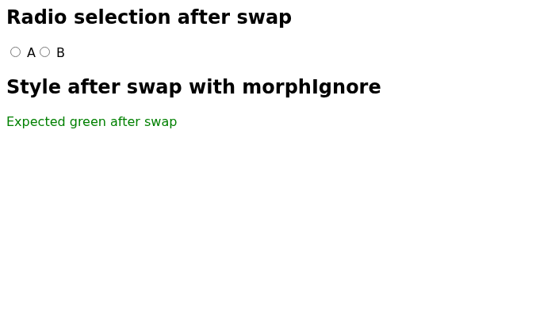
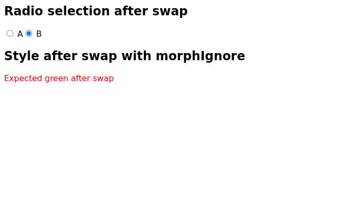
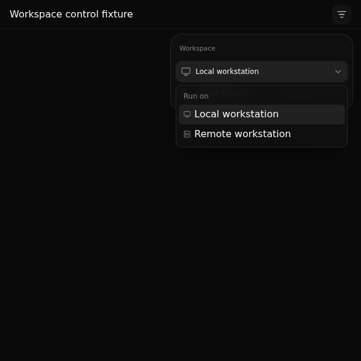
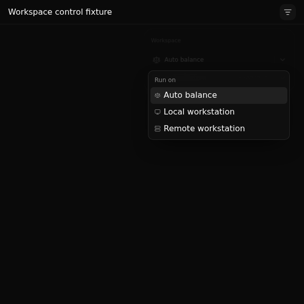

# Historical PR replay validation

On 18 September 2026, Crow reviewed seven real public PRs and one deliberately reversed fix using the configured gpt-6-astra model at high reasoning. It found a reproducible regression in an actual htmx PR and caught the reversed Python fix even though the existing Python tests passed. Large application setup remains a limitation.

Each review used immutable commits and the original PR title/body. The preparation script checked the local changed paths against GitHub's PR file list. Crow selected its own dependencies, commands, reproductions and browser checks through the production MCP tools. We did not give it testing recipes beyond what the original authors had written. No upstream reviews or comments were posted.

The [raw reports and command receipts](historical-reviews.json) preserve failed setup, timeouts, retries and partial coverage. The [replay scripts](../../examples/historical_reviews/README.md) reproduce the process. This is a selected evaluation, not a representative benchmark or a claim that clean reviews prove the absence of bugs.

| Comparison | What Crow actually verified | Result and limits |
| --- | --- | --- |
| [Werkzeug #3255](https://github.com/pallets/werkzeug/pull/3255), Python HTTP range parsing | Installed dependencies; 374 relevant tests and nine additional boundary checks passed. | No findings. Tested head, without a full base suite for this clean review. |
| Inverse of Werkzeug #3255, regression control | All 374 relevant existing tests passed at both revisions. Crow's extra request check returned HTTP 416 at base and HTTP 206 with the full body at head for `Range: bytes=-0`. | Correctly reported the deliberately reintroduced bug. This inverse is not an upstream PR; its reviewer received neutral context without the expected answer. |
| [Chi #1185](https://github.com/go-chi/chi/pull/1185), Go response flushing | Race-enabled tests passed for both packages. Crow's 32 HTTP/1.1 and HTTP/2 integration cases passed at head; 16 discard cases failed at base. Separate `go vet` passed after a combined command timed out. | Confirmed the intended fix, no findings. Other Go versions and Windows were not tested. |
| [itoa #68](https://github.com/dtolnay/itoa/pull/68), Rust integer formatting | Existing tests plus boundary and 100,000 randomized inputs passed on both revisions with optimization levels 0 and 3. Cargo debug tests also passed. | No findings. A combined Cargo command timed out compiling release dependencies; the no-panic feature check and performance claim remain unverified. |
| [T3 Code #12488](https://github.com/pingdotgg/t3code/pull/12488), TypeScript import scanner | After the Crow archive fix, it installed a small focused dependency set and imported the real source. Its 12 scanner cases passed at head; six failed at base. | Confirmed the intended improvements, no findings. Full packaging tests and typechecks did not run. |
| [T3 Code #12443](https://github.com/pingdotgg/t3code/pull/12443), web workspace controls | Passed 82 focused head tests. After an operator-initiated resume, rendered actual panel components with mocked state at 1440, 600 and 390 pixels on base/head; exercised host selection, Auto balance, panel opening and workspace locking; viewed six screenshots. | No findings within that scope. The original ten-minute attempt timed out. Full-app integration, typechecking and branch-picker behavior remain unverified. This upstream PR was closed without merging. |
| [T3 Code #12394](https://github.com/pingdotgg/t3code/pull/12394), Android input styling | After the archive fix, it installed Expo's config-plugins and exercised the real mod pipeline for insertion, replacement, resource preservation and idempotency. | No findings in the plugin checks. Full application setup exceeded the disk allowance. No Android SDK, Java or emulator was available, so the native appearance remains unverified. |
| [htmx #4056](https://github.com/bigskysoftware/htmx/pull/4056), radio-button CSS settling | Installed dependencies, ran three relevant Chromium test files with 187 passing tests and one skipped test, then created and viewed screenshots of a base/head reproduction. | Confirmed the radio fix and found an additional stale-style regression despite the passing existing tests. |

## The real browser finding

The htmx change fixes radio buttons losing their selection during a swap. Crow also tested a replacement element whose style should change from red to green, with `morphIgnore` configured to include `style`. The new code copies the old style unconditionally, while restoration still skips ignored attributes. The element stays red.

| Before the PR | After the PR |
| --- | --- |
|  |  |

These are actual screenshots captured by Crow's Chromium experiment and delivered to the reviewer as native image content. They show a small reproduction loading the repository's actual `src/htmx.js`, not the htmx documentation website or screenshots supplied by the PR author. We independently repeated the experiment in Crow's sandbox, waited another 500 ms, and asserted the computed color. Base passed with `rgb(0, 128, 0)`; head failed with `rgb(255, 0, 0)`. Those verification receipts are included under `independentChecks`.

## T3 component browser checks

The web review recovered from several failed installs by choosing a small dependency set. It passed 82 tests in `BranchToolbar.logic.test.ts` and `rightPanelLayout.test.ts` at head, then hit the ten-minute review deadline. We explicitly resumed the saved session in a separate attempt. Crow recovered its receipts and environments, repaired two component-build failures, and completed the browser checks without new test instructions. The combined session used twelve experiments; the continuation did not reset that limit.

| Base host menu | Head host menu |
| --- | --- |
|  |  |

These screenshots show actual `ThreadDetailsPanel` and `PanelLayoutControls` components with the repository CSS. The fixture mocks stores, host data, the branch selector and unrelated controls. It checks selected component behavior, not the running T3 server, full `ChatView`, branch loading or integration with real workspaces. The head fixture exercises panel opening through the component handle, not the complete application keyboard binding path. Crow inspected all six captured images.

## Crow fixes prompted by these runs

The original 128 MiB source archive limit blocked every T3 comparison before any command could run. T3 had about 253 MB of tracked files. Source export now follows the configured workspace allowance, capped at 512 MiB. It still streams to a bounded file and never extracts repository archives on the host. A regression test verifies both rejection and successful export under different bounds. Subsequent T3 reviews reached actual setup and focused tests.

The package gateway used to accept and discard connections when all 16 tunnel slots were occupied. Concurrent pnpm requests then received connection resets. The gateway now leaves excess requests in the bounded socket backlog until a slot is free, keeping the same active-connection cap. A saturation test verifies that the seventeenth request waits and is handled after a slot is released. A [real managed-container check](historical-gateway.json) also downloaded and validated 24 npm package responses concurrently under the production default limits. The next full T3 install progressed to disk exhaustion instead of the earlier connection-reset errors. This does not make the whole monorepo fit within 512 MiB.

## Conditions and remaining gaps

The replay runner used the earlier validation settings: a ten-minute review deadline, twelve runtime attempts, 120 seconds per command, 1.5 GiB memory, two CPUs, 256 processes and a 512 MiB workspace. These are existing settings, not new user-facing budget options. Production defaults use 1 GiB memory and 128 processes. These are historical source comparisons with the available managed toolchain and registry packages, not reconstructions of the original CI machines. Most reviews ran alongside another review on a shared rootless Podman store, so timings are not isolated performance measurements.

T3 declares Node 24, while the managed image used Node 22.23.2. The focused probes do not validate compatibility with the declared Node version or the complete development environment.

The initial six-PR group and inverse ran before these fixes. The htmx case was added after the archive fix. `retry-archive` and `retry-gateway` name fresh autonomous reviews after each change. Original failed attempts remain in the JSON. Two web replay drivers returned shell status 143 without final reports; the cause was not established. A final replay used a detached driver and a pinned reviewer executable but reached its ten-minute review deadline. The separately labelled `retry-resume` is an operator-initiated continuation with another review turn. It retains the same twelve-experiment limit and includes inherited receipts, which must not be counted twice. An interrupted or timed-out review is not a clean result.

A receipt marked `passed` means the shell command exited zero. It can still contain an earlier failed subcommand if the generated script continued. For example, one T3 scanner setup exited successfully after a Node installation failed; Crow noticed and retried. The htmx screenshots also came from successful diagnostic commands that printed differing states; the separate verification adds a failing assertion at head.

Crow's ordinary suite passed 236 tests, including the new archive and gateway regression tests. Formatting and clippy passed. The selected PRs demonstrate useful autonomous investigation and honest partial coverage; they do not establish support for full native mobile applications or arbitrary large monorepos.
